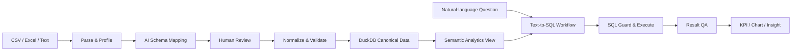
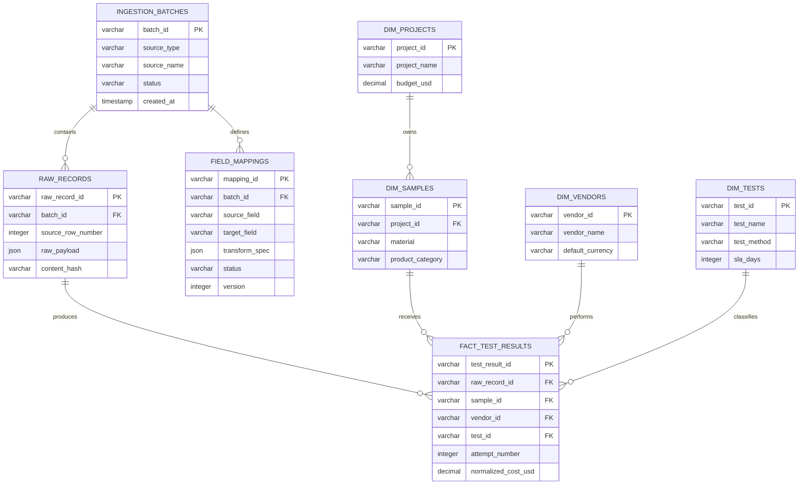
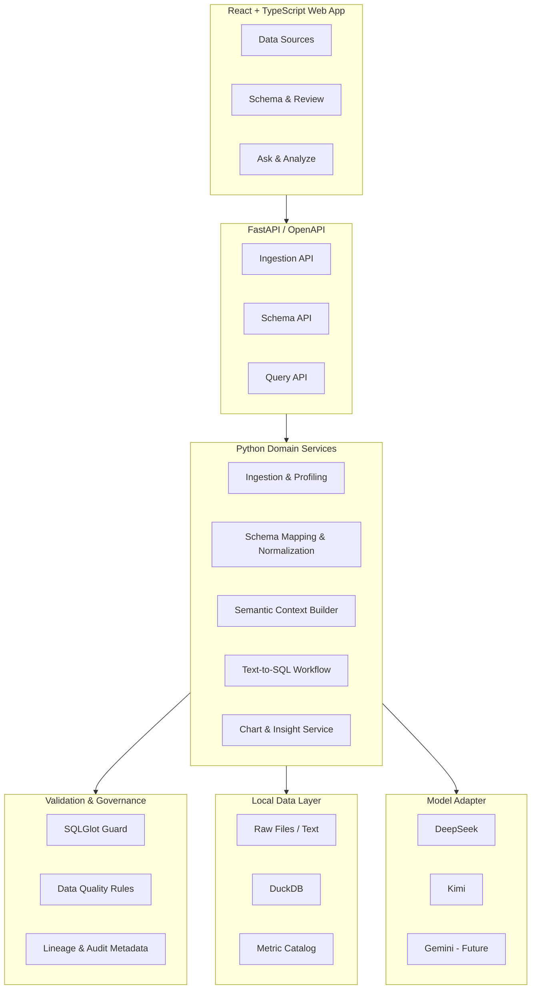

# Mini Hackathon：异构实验室数据智能分析工作台

> 文档状态：最终方案（实施前评审版）  
> 目标：在 4 小时内交付一个可运行、可演示、能解决真实问题的纵向 MVP  
> 技术栈：React、TypeScript、Vite、FastAPI、DuckDB、Polars、SQLGlot、Apache ECharts、OpenAI-compatible LLM API

## 1. 执行摘要

企业内部同事经常需要处理来自不同供应商的 CSV、Excel、邮件、文档描述或 Slack 对话。这些数据存在字段名称不一致、指标口径不一致、格式不统一、上下文缺失等问题。即使数据被整理出来，用户仍需理解 Schema、编写 SQL、使用 BI 工具，并自行从结果中寻找异常和趋势。

本项目交付一个“从原始数据到可信洞察”的本地数据工作台，完成以下闭环：

1. 接收 CSV、Excel 和非结构化文本；
2. 识别数据结构、业务字段和质量问题；
3. 将不同供应商的数据映射为统一 Schema；
4. 让用户预览、确认并修正 AI 映射结果；
5. 将标准化数据写入本地分析数据库；
6. 允许用户用自然语言进行聚合、对比和趋势分析；
7. 自动生成可解释的 SQL、KPI、图表和文字洞察。

本次 Demo 使用“第三方实验室测试管理”作为具体业务场景。该场景包含供应商、项目、样品、测试类型、费用、交付周期、状态和测试结果，能够自然展示异构数据接入、跨来源分析、指标治理与异常发现。

### 1.1 产品价值主张

产品不是简单的“文件上传 + ChatBI”，核心价值是：

> 将异构、低质量、缺乏统一口径的原始信息，转换为可信、可追溯、可直接分析的标准数据，并降低从业务问题到分析结论的门槛。

### 1.2 成功标准

MVP 成功不以支持最多文件类型或最多 Agent 为标准，而以一条稳定的端到端路径为标准：

- 用户能看到不同供应商数据的结构差异；
- 系统能生成合理的标准字段映射；
- 用户能确认映射并追溯原始来源；
- 用户无需写 SQL 就能完成跨来源分析；
- 系统能生成正确、直观且有业务意义的图表和洞察；
- Demo 在没有临场修改代码的情况下可以重复运行。

## 2. 用户、问题与使用场景

### 2.1 目标用户

- 企业内部产品开发、研发、质量、采购和项目管理同事；
- 典型团队规模为十几人到几十人；
- 熟悉业务，但不一定熟悉数据库、SQL 或 BI 工具；
- 需要临时整合多个供应商或项目的数据进行判断。

### 2.2 核心痛点

| 痛点 | 当前成本 | 产品响应 |
|---|---|---|
| 数据来源和格式不统一 | 手工复制、改列名、补上下文 | 自动 Profiling、Schema Mapping 和标准化 |
| 字段和指标口径不一致 | 反复向业务或供应商确认 | 业务语义层、字段词典和指标定义 |
| 数据建模和查询复杂 | 建表、关联字段、编写 SQL | 统一分析视图和 Text-to-SQL |
| 查询结果缺乏解释 | 依赖分析师或 BI 二次加工 | KPI、图表、趋势和异常总结 |
| AI 结果难以信任 | 无法知道数据从哪里来、为何这样映射 | 人工确认、置信度、数据血缘和 SQL 透明化 |

### 2.3 核心用户故事

1. 作为项目成员，我希望上传不同供应商的数据文件，系统能自动识别其字段并映射到统一口径。
2. 作为业务负责人，我希望粘贴一段邮件或 Slack 对话，将其中的实验结果转换为结构化记录。
3. 作为数据使用者，我希望在入库前确认和修改字段映射，避免错误数据直接污染分析结果。
4. 作为管理者，我希望直接询问供应商成本、通过率、交付周期和项目预算情况，无需编写 SQL。
5. 作为决策者，我希望系统指出趋势、异常和可能的关联，而不只是返回一张数字表。

## 3. 产品范围

### 3.1 四小时内必须交付（P0）

- CSV 和 Excel 上传；
- 邮件或 Slack 风格文本粘贴；
- 数据 Profiling：列名、类型、空值、样例值和候选枚举；
- 原始字段到标准字段的 AI 映射建议；
- 映射预览与人工确认；
- 日期、结果枚举、币种等关键字段标准化；
- 原始记录、导入批次和标准记录的关联；
- DuckDB 本地持久化；
- 基于受控语义上下文的 Text-to-SQL；
- SQL 只读校验、执行限制和有限修复；
- KPI、表格、Apache ECharts 图表和洞察总结；
- 可重复执行的 Demo 数据与演示脚本。

### 3.2 有余量再交付（P1）

- 1–2 份 PDF 或图片实验报告的 Vision 提取；
- 数据质量评分和异常值高亮；
- 推荐追问；
- 查询历史；
- 映射规则保存与复用。

### 3.3 本次明确不做（P2 / Future）

- 真实 Slack、邮箱、SharePoint 等在线连接器；
- 用户登录、细粒度权限和多租户；
- 定时调度、增量同步和 CDC；
- 任意数据库接入；
- 通用向量检索平台；
- 多 Agent 自主规划；
- 主动告警和自动联系供应商；
- 企业级数据目录、审批和完整审计平台。

## 4. 产品交互与最终页面

MVP 交付一个可供最终用户直接使用的响应式 Web 产品，而不是数据脚本或 Streamlit 原型。前端使用 React + TypeScript，实现统一导航、明确的操作反馈和完整的加载、空状态、失败状态。产品包含三个主页面。

### 4.1 Data Sources：数据接入

用户可以：

- 上传 CSV 或 Excel；
- 粘贴邮件、文档或 Slack 对话文本；
- 选择供应商或让系统识别供应商；
- 查看文件名、来源类型、记录数、处理状态和导入时间；
- 使用内置 Demo 数据一键初始化环境。

页面需要明确区分 `Uploaded`、`Needs Review`、`Ready` 和 `Failed`，让数据处理状态可见。

### 4.2 Schema & Review：映射与确认

该页面是产品区别于普通 ChatBI Demo 的关键页面，需要展示：

- 原始列名、推断类型和样例值；
- 推荐的标准字段；
- AI 置信度；
- 日期格式、币种、单位和枚举转换建议；
- 无法识别或缺失的字段；
- 标准化后的数据预览；
- 用户修改映射并确认入库的操作。

AI 只提供建议，用户确认后才写入 Canonical 层。Demo 中至少要展示一个自动映射正确的字段，以及一个需要用户确认或修正的字段。

### 4.3 Ask & Analyze：查询与洞察

页面包含：

- 自然语言问题输入框；
- 可点击的示例问题；
- 一句话结论；
- KPI 卡片；
- 主图表；
- 查询结果表；
- 关键洞察和异常提示；
- 可展开查看的 SQL、指标口径和筛选条件。

系统不隐藏 SQL，而是让 SQL 成为可解释性的一部分。

### 4.4 全局导航和页面关系

- 顶部产品栏：产品名称、当前数据范围、系统状态和帮助入口；
- 左侧窄导航：`Sources`、`Schema`、`Analyze`；
- Sources 列表点击后进入对应批次的 Review 页面；
- Review 完成并发布后，Analyze 页面立即可查询新数据；
- 所有耗时操作显示当前阶段，而不是只显示无含义的旋转图标；
- 错误信息同时告诉用户“发生了什么”和“下一步怎么做”。

### 4.5 Apple 式产品视觉规范

设计目标是简约、克制、高级和可信。参考 Apple 产品界面的信息层级、留白、排版和动效节奏，但不复制 Apple 商标、图标或具体页面。

#### 视觉原则

1. **内容优先**：减少装饰元素，突出数据、状态和主要操作；
2. **大面积留白**：页面内容最大宽度约 1,440px，模块间距使用 24–32px；
3. **清晰层级**：通过字号、字重、灰阶和间距建立层级，不依赖大量边框；
4. **单一主色**：仅主操作、选中状态和关键数据使用蓝色；
5. **轻量材质**：卡片使用低对比边框和极轻阴影，毛玻璃只用于顶部栏或浮层；
6. **动效克制**：状态变化使用 160–240ms 的淡入、位移或颜色过渡；
7. **专业可信**：数据表和 SQL 保持高密度可读性，不为了“高级感”牺牲信息效率。

#### 颜色 Token

| Token | 颜色 | 用途 |
|---|---|---|
| `--bg-page` | `#F5F5F7` | 页面背景 |
| `--bg-surface` | `#FFFFFF` | 主卡片和面板 |
| `--bg-subtle` | `#F9F9FB` | 次级区域、表头和输入背景 |
| `--text-primary` | `#1D1D1F` | 标题和主要正文 |
| `--text-secondary` | `#6E6E73` | 辅助说明 |
| `--text-tertiary` | `#86868B` | 占位和弱信息 |
| `--border-subtle` | `#D2D2D7` | 输入框和分隔线 |
| `--accent` | `#007AFF` | 主按钮、链接和选中状态 |
| `--success` | `#34C759` | Ready、Pass |
| `--warning` | `#FF9F0A` | Needs Review、质量警告 |
| `--danger` | `#FF3B30` | Failed、Fail、破坏性操作 |

#### 排版、圆角与阴影

- 字体：`-apple-system, BlinkMacSystemFont, "SF Pro Display", "SF Pro Text", "Segoe UI", sans-serif`；
- 页面标题：32px / 38px，600；
- 区块标题：20px / 26px，600；
- 正文：15px / 22px，400；
- 辅助文字：13px / 18px，400；
- 数据数字使用 `font-variant-numeric: tabular-nums`；
- 主卡片圆角 20px，输入框和按钮圆角 10–12px；
- 卡片阴影控制在 `0 8px 30px rgba(0,0,0,0.06)` 以内；
- 所有颜色必须满足可读性要求，状态不能只依赖颜色表达。

#### 核心组件

- `AppShell`、`TopBar`、`SideNav`；
- `PageHeader`、`SectionCard`、`StatusBadge`；
- `UploadDropzone`、`SourceList`；
- `ProfileSummary`、`MappingTable`、`DataPreview`；
- `QuestionComposer`、`SuggestedQuestion`；
- `KpiCard`、`InsightCard`、`ChartPanel`、`ResultTable`；
- `SqlDisclosure`、`MetricDisclosure`、`WarningBanner`；
- `Skeleton`、`EmptyState`、`ErrorState` 和 `Toast`。

桌面端是 Hackathon 的主要演示形态，最小支持宽度为 1,024px；窄屏下侧栏折叠，表格允许横向滚动，但不要求完成完整移动端设计。

## 5. 端到端处理流程



流程中的关键产品判断如下：

1. **先标准化再问答**：直接对原始供应商文件做 Text-to-SQL，模型需要同时猜测字段语义和业务口径，稳定性不足。
2. **保留人工确认**：AI 映射存在概率性，关键数据不能无审核进入分析层。
3. **分析使用统一视图**：底层可以规范化建模，但向模型提供字段含义清晰的宽视图，降低 Join 错误率。
4. **SQL 与洞察分阶段生成**：SQL 负责获得事实，洞察模型只能基于执行结果总结，避免模型凭空生成数字。
5. **图表由受控配置驱动**：模型不能生成并执行任意 Python 绘图代码。

## 6. Demo 数据方案

由于当前没有真实文件，项目将生成一套确定性、可重复、带有业务故事的合成数据。生成脚本使用固定随机种子，保证每次演示得到相同结果。

### 6.1 数据规模

| 项目 | 规模 |
|---|---:|
| 测试结果记录 | 约 1,000 条 |
| 实验室供应商 | 6 家 |
| 项目 | 10 个 |
| 样品 | 约 250 个 |
| 测试类型 | 12 种 |
| 时间范围 | 最近 6 个月 |
| 币种 | USD、SGD、CNY |
| 原始输入形式 | CSV、Excel、文本，PDF/图片可选 |

### 6.2 原始数据包

| 数据源 | 形式 | 设计目的 |
|---|---|---|
| Vendor A | CSV，约 350 条 | 字段接近标准，展示快速接入 |
| Vendor B | Excel，约 300 条 | 使用不同列名、日期格式和结果编码 |
| Vendor C/D/E/F | CSV，约 300 条 | 增加供应商、项目和币种的分析维度 |
| Email / Slack 样例 | 文本，约 30–50 条 | 展示非结构化信息提取 |
| Lab Report 样例 | PDF/图片，1–2 份，可选 | 展示 Vision 扩展能力，不影响主流程 |

### 6.3 必须植入的数据故事

合成数据不能是均匀随机数，必须预先植入可被查询发现的事实：

- Vendor B 的价格较低，但平均交付周期明显更长；
- Vendor D 在最近两个月出现成本上涨；
- 某一材料在特定测试项目上的失败率显著偏高；
- 某项目预算使用率超过 90%；
- 某批次测试集中延期；
- 同一样品因首次失败被重复测试；
- 少量记录存在未知币种、异常日期或缺失结果，用于展示数据质量检查。

这些故事同时构成 Demo 的正确性基准。系统输出的洞察必须能对应到预埋事实，而不是仅生成听起来合理的描述。

## 7. 从原始数据到 Schema 的最佳实践

### 7.1 分层原则

数据分为三个逻辑层：

#### Raw 层

- 原样保留文件元数据、文本内容和原始记录；
- 不覆盖、不静默修正原始数据；
- 为每次导入生成 `batch_id`；
- 为每条原始记录生成 `raw_record_id`；
- 保存来源类型、来源名称和导入时间。

#### Canonical 层

- 使用统一字段名称和类型；
- 标准化日期、状态、测试结果、币种和单位；
- 保存来源记录 ID 和映射版本；
- 对无法确定的值保留 `NULL` 和质量标记，不伪造默认值；
- 业务实体使用稳定 ID，不使用显示名称作为唯一键。

#### Analytics 层

- 向分析用户和 LLM 暴露语义清晰的宽表视图；
- 提供一致的指标、维度和默认过滤规则；
- 隐藏原始技术字段和不必要的复杂 Join；
- 不将项目预算复制到每条测试事实中，避免聚合时重复计算。

### 7.2 Schema 建模步骤

#### 第一步：识别业务粒度

先回答“一行数据代表什么”。本项目的事实表粒度定义为：

> 一行代表某个样品在某家实验室执行某项测试的一次尝试。

重复测试通过 `attempt_number` 区分，不能覆盖第一次失败记录。

#### 第二步：区分维度、事实和派生指标

- 维度：项目、供应商、样品、材料、测试类型、日期、状态；
- 事实：测试费用、测量值、提交日期、完成日期、测试结果；
- 派生指标：周转时间、通过率、预算使用率、超期率。

派生指标尽量在语义层定义，不要求每个供应商提供。

#### 第三步：建立 Canonical 字段词典

每个标准字段至少定义：

- 字段名称；
- 业务说明；
- 数据类型；
- 是否必填；
- 允许值或单位；
- 来源字段示例；
- 缺失值处理方式；
- 是否可作为过滤或分组维度。

#### 第四步：Profile 原始数据

对每个来源提取：

- 列名和推断类型；
- 样例值；
- 空值率；
- 唯一值数量；
- 数字范围；
- 高频枚举；
- 日期格式候选；
- 重复行和异常值。

Profiling 结果和字段词典共同作为 Schema Mapping 的模型上下文。

#### 第五步：生成并确认映射

模型返回结构化映射，不直接返回自由文本。每个字段至少包含：

```json
{
  "source_field": "specimen_no",
  "target_field": "sample_id",
  "confidence": 0.96,
  "transform": "trim",
  "reason": "Values match the sample identifier pattern"
}
```

低置信度、多个候选目标、单位不明确或关键字段缺失时，必须进入人工确认状态。

#### 第六步：标准化和质量校验

标准化规则包括：

- 日期统一为 ISO 日期；
- `PASS`、`Passed`、`OK`、`P` 统一为 `PASS`；
- `FAIL`、`Failed`、`NG`、`F` 统一为 `FAIL`；
- 费用保留原币金额，同时生成统一 USD 金额；
- 供应商名称使用别名表归一化；
- 周转时间由日期计算，不信任供应商提供的同名字段；
- 测量值和单位分开保存；
- 无法转换的记录进入错误清单，不静默丢弃。

#### 第七步：发布分析视图

只有通过最低质量校验并完成映射确认的数据才能进入分析视图。每次发布记录映射版本和导入批次，保证查询结果可追溯。

### 7.3 字段映射示例

| Vendor A | Vendor B | 文本表达 | Canonical 字段 |
|---|---|---|---|
| `sample_no` | `specimen_id` | “sample S-102” | `sample_id` |
| `test_item` | `analysis_name` | “performed tensile test” | `test_name` |
| `conclusion` | `outcome_code` | “result was acceptable” | `result` |
| `fee_usd` | `invoice_amount` | “cost SGD 420” | `cost_amount` + `currency` |
| `completed_at` | `report_date` | “completed on 12 Jul” | `completed_date` |

字段名称只是信号之一，映射还必须结合样例值、数据类型、供应商上下文和 Canonical 字段说明。

## 8. Canonical 数据模型

### 8.1 核心表

| 表或视图 | 粒度与职责 |
|---|---|
| `ingestion_batches` | 一次文件或文本导入，记录来源和处理状态 |
| `raw_records` | 一条未经修改的原始记录或文本片段 |
| `field_mappings` | 某批次的字段映射、转换规则、置信度和确认状态 |
| `dim_projects` | 项目、负责人、预算和时间范围 |
| `dim_vendors` | 供应商标准名称、别名和默认币种 |
| `dim_samples` | 样品、材料、产品类别和所属项目 |
| `dim_tests` | 测试名称、测试方法、指标单位和 SLA |
| `fact_test_results` | 一次测试尝试的费用、时间、测量值、状态和结果 |
| `vw_test_results` | 面向 Text-to-SQL 的宽分析视图 |
| `metric_catalog` | 指标名称、业务定义、SQL 表达式、允许维度和同义词 |

### 8.2 测试事实表关键字段

| 字段 | 类型 | 说明 |
|---|---|---|
| `test_result_id` | VARCHAR | 一次测试尝试的稳定 ID |
| `sample_id` | VARCHAR | 样品 ID |
| `test_id` | VARCHAR | 测试类型 ID |
| `vendor_id` | VARCHAR | 实验室供应商 ID |
| `attempt_number` | INTEGER | 同一样品同一测试的尝试次数 |
| `submitted_date` | DATE | 提交日期 |
| `completed_date` | DATE | 完成日期 |
| `status` | VARCHAR | `PENDING`、`IN_PROGRESS`、`COMPLETED`、`CANCELLED` |
| `result` | VARCHAR | `PASS`、`FAIL`、`INCONCLUSIVE`、`NULL` |
| `measured_value` | DOUBLE | 测量值，可为空 |
| `value_unit` | VARCHAR | 测量单位 |
| `lower_limit` | DOUBLE | 合格下限，可为空 |
| `upper_limit` | DOUBLE | 合格上限，可为空 |
| `cost_amount` | DECIMAL | 原币费用 |
| `currency` | VARCHAR | 原始币种 |
| `normalized_cost_usd` | DECIMAL | 标准化 USD 费用 |
| `raw_record_id` | VARCHAR | 原始记录血缘 |
| `mapping_version` | VARCHAR | 使用的映射版本 |

### 8.3 为什么同时使用星型模型和宽视图

- 星型模型避免预算、供应商和样品属性被重复存储，保证数据一致性；
- 宽视图减少 LLM 生成复杂 Join 的概率；
- 数据维护面向规范化表，分析面向 `vw_test_results`；
- 项目预算保存在 `dim_projects`，分析视图可以暴露预算字段，但指标定义必须使用去重后的项目预算，不能逐行求和。

### 8.4 表关系



### 8.5 物理表字段与约束

#### `ingestion_batches`

- 主键：`batch_id`；
- 字段：`source_type`、`source_name`、`vendor_hint`、`status`、`record_count`、`quality_score`、`error_code`、`error_message`、`created_at`、`updated_at`；
- `status` 只能使用 API 状态机枚举；
- 同一个 `Idempotency-Key` 在有效期内只能创建一个批次。

#### `raw_records`

- 主键：`raw_record_id`；外键：`batch_id`；
- 字段：`source_row_number`、`raw_payload`、`raw_text`、`content_hash`、`created_at`；
- `raw_payload` 保存表格行的原始 JSON，`raw_text` 保存文本片段，两者至少一个非空；
- 唯一约束：`(batch_id, content_hash)`，防止同批次内重复写入；
- Raw 数据只追加，不执行原地修改。

#### `field_mappings`

- 主键：`mapping_id`；外键：`batch_id`；
- 字段：`source_field`、`target_field`、`confidence`、`transform_spec`、`reason`、`status`、`version`、`confirmed_by`、`confirmed_at`；
- 唯一约束：`(batch_id, source_field, version)`；
- 发布后不覆盖旧版本；修改映射创建新版本。

#### `dim_projects`

- 主键：`project_id`；
- 字段：`project_name`、`owner_name`、`budget_usd`、`start_date`、`end_date`；
- `budget_usd >= 0`；项目预算只在该表维护。

#### `dim_vendors`

- 主键：`vendor_id`；
- 字段：`vendor_name`、`vendor_aliases`、`default_currency`；
- `vendor_name` 唯一；别名用于标准化，不直接作为关联键。

#### `dim_samples`

- 主键：`sample_id`；外键：`project_id`；
- 字段：`material`、`product_category`、`sample_description`；
- 一个样品只属于一个项目；项目未知时进入数据质量警告，不能虚构项目。

#### `dim_tests`

- 主键：`test_id`；
- 字段：`test_name`、`test_method`、`default_unit`、`sla_days`；
- 业务唯一键：`(test_name, test_method)`。

#### `fact_test_results`

- 主键：`test_result_id`；
- 外键：`raw_record_id`、`sample_id`、`vendor_id`、`test_id`；
- 除 8.2 字段外增加 `business_key_hash`、`validation_status`、`created_at`；
- `attempt_number >= 1`、费用不得为负、完成日期不得早于提交日期；
- `business_key_hash` 根据标准化后的样品、测试、供应商、尝试次数和日期生成，用于提示潜在重复；
- 重复提示不直接删除事实，由用户或确定性规则决定是否合并。

#### `metric_catalog`

- 主键：`metric_key`；
- 字段：`display_name`、`description`、`sql_expression`、`format`、`allowed_dimensions`、`synonyms`、`default_time_field`、`version`；
- 模型只能使用目录中的受批准指标；指标修改需要版本号。

### 8.6 数据库模型与 API 模型边界

- 数据库模型为持久化、约束和查询优化服务；
- API 模型为用户任务和前端展示服务；
- 后端必须显式把数据库记录映射为 API DTO，禁止直接序列化数据库行；
- `raw_payload`、模型 Prompt、内部错误堆栈和未授权 SQL 字段不能通过公共 API 返回；
- API 可以组合多个物理表，例如 `IngestionBatch` 同时包含批次状态、错误和统计摘要；
- 数据库新增内部字段不应导致前端接口变化。

## 9. 业务语义层

语义层解决字段含义、指标口径和 Join 正确性，是 Text-to-SQL 稳定性的核心，不只是附加说明。

### 9.1 MVP 指标

| 指标 | 定义 |
|---|---|
| `test_count` | 测试尝试记录数 |
| `completed_test_count` | `status = 'COMPLETED'` 的记录数 |
| `total_test_cost_usd` | `SUM(normalized_cost_usd)` |
| `pass_rate` | 已完成且结果为 PASS 的数量 / 已完成且结果为 PASS 或 FAIL 的数量 |
| `failure_rate` | 已完成且结果为 FAIL 的数量 / 已完成且结果为 PASS 或 FAIL 的数量 |
| `avg_turnaround_days` | 已完成记录的 `completed_date - submitted_date` 平均值 |
| `on_time_rate` | 周转时间不超过测试 SLA 的已完成记录占比 |
| `budget_utilization` | 项目累计测试费用 / 项目预算；预算按项目去重 |
| `retest_rate` | `attempt_number > 1` 的测试记录占比 |

### 9.2 语义目录包含的信息

- 指标名称和公式；
- 用户可使用的中英文同义词；
- 可用维度；
- 默认时间字段；
- 默认过滤规则；
- 空值和分母为零的处理方式；
- 表关联关系；
- 示例问题和参考 SQL。

例如“费用、成本、测试支出、花费”统一指向 `total_test_cost_usd`；“成功率、通过比例”统一指向 `pass_rate`。

## 10. 技术架构



### 10.1 技术选型

| 组件 | 最终选择 | 考虑与取舍 |
|---|---|---|
| Python 运行时 | 实施前锁定已验证版本 | 当前项目声明 Python 3.14；正式开工前先对全部依赖做安装和导入冒烟测试，如有兼容问题则立即固定到团队已验证版本，不能在 Hackathon 中临时排查环境问题 |
| Web 前端 | React + TypeScript + Vite | 支持前后端并行、类型约束和完整产品化界面；无需 SSR，不引入 Next.js 的额外复杂度 |
| 样式方案 | CSS Variables + CSS Modules | 设计 Token 明确、依赖少、可以精确实现 Apple 式视觉；不在四小时内搭建庞大组件库 |
| API | FastAPI + Pydantic + OpenAPI | Python 技术栈一致，自动校验并输出 OpenAPI；前端可据此生成类型和 Mock |
| 数据库 | DuckDB | 适合文件接入、聚合和本地 OLAP；零服务部署；比 SQLite 更贴合分析场景 |
| 数据处理 | Polars | 用于读取、Profiling、清洗和批量转换；性能好且表达清晰 |
| SQL 解析 | SQLGlot | 做 AST 校验、表和函数白名单、SQL 规范化及有限方言处理 |
| 图表 | Apache ECharts | 前端原生交互强，样式控制细，适合统一的数据集与白名单图表配置 |
| 前端数据访问 | 生成的 TypeScript API Client | 直接来自 OpenAPI，避免前后端各维护一套字段名称和枚举 |
| 前端 Mock | Mock Service Worker | 后端未完成时按同一契约返回固定数据，支持真正并行开发 |
| 模型调用 | 自定义轻量 `ModelClient` | Demo 接入 DeepSeek/Kimi 的 OpenAI-compatible API，未来通过适配器接入 Gemini |
| 工作流 | 显式 Python 状态流程 | 当前步骤固定，LangGraph 会增加依赖和调试成本；复杂 Agent 流程后续再引入 |
| 指标抽象 | 轻量 Metric Catalog | YAML/JSON 或 DuckDB 表即可满足 MVP，不引入完整语义层平台 |

### 10.2 为什么选择独立前端和 FastAPI

最终交付需要是面向用户的产品界面，且团队希望前后端并行开发，因此独立前端的收益高于 Streamlit 的开发速度优势。React 负责产品体验和数据可视化，FastAPI 负责数据处理、模型调用和查询安全，两者只通过版本化 HTTP API 通信。

这不是微服务拆分：后端仍是一个 FastAPI 进程和一个 DuckDB 文件。开发期 Vite 与 FastAPI 分别启动，便于热更新；交付时先构建前端静态文件，再由 FastAPI 托管静态产物和 API，从而保持一个命令启动。

前后端并行的前提不是口头约定字段，而是在开发开始前冻结第一版 `contracts/openapi.yaml`。任何破坏性修改必须先更新契约、重新生成前端类型，再修改实现。

### 10.3 为什么暂不使用 Ibis

DuckDB 已负责 SQL 执行，MVP 再引入 Ibis 会产生两套查询表达方式。固定指标通过 Metric Catalog 和受控 SQL 模板实现即可。未来需要跨 DuckDB、ClickHouse、StarRocks 等引擎时，再评估 Ibis。

### 10.4 为什么暂不使用 LangGraph

当前工作流是明确的生成、校验、执行、修复、总结顺序流程。普通 Python 状态对象更容易调试、测试和演示。只有出现复杂分支、多 Agent、持久化中断恢复或多轮工具协作时，LangGraph 才能体现价值。

### 10.5 为什么暂不使用向量检索

MVP 只有一个分析视图、少量维度和指标，完整语义上下文可以直接提供给模型。向量化 Metadata Retriever 和 Example Retriever 会增加切分、Embedding、索引和召回评估成本。Schema 扩展到几十或几百张表后再引入检索。

### 10.6 API 契约原则

`contracts/openapi.yaml` 是前后端唯一接口真相源。后端 Pydantic 模型、Swagger 文档、前端 TypeScript 类型和 Mock 响应必须与它一致。

- API 统一使用 `/api/v1` 前缀；
- JSON 字段统一使用 `snake_case`，前端不做二次字段改名；
- ID 使用 UUID 字符串；
- 日期使用 `YYYY-MM-DD`，时间使用 UTC ISO 8601；
- 状态和结果使用固定大写枚举；
- 可缺失字段必须显式声明为 nullable，不用空字符串代表缺失；
- 列表接口统一返回 `items`、`total`、`page`、`page_size`；
- 所有错误使用统一 `ErrorResponse`；
- 每个响应包含或通过 Header 返回 `request_id`，便于前后端定位问题；
- 上传和发布操作支持 `Idempotency-Key`，避免用户重复点击产生重复记录；
- 第一版 API 只做向后兼容字段追加；删除字段、改名或改变枚举属于破坏性修改。

### 10.7 Ingestion 状态机

| 状态 | 含义 | 前端行为 |
|---|---|---|
| `UPLOADED` | 文件或文本已接收 | 显示已上传 |
| `PROFILING` | 正在解析和统计 | 展示 Profiling 进度 |
| `MAPPING` | 正在生成字段映射 | 展示 AI Mapping 进度 |
| `NEEDS_REVIEW` | 映射已生成，等待用户确认 | 提供 Review 主按钮 |
| `COMMITTING` | 正在标准化和入库 | 禁用重复提交 |
| `READY` | 已进入 Analytics 层 | 提供 Analyze 入口 |
| `FAILED` | 任一步骤失败 | 展示错误阶段和重试入口 |

上传接口快速返回 `202 Accepted` 和 `batch_id`。后端使用进程内后台任务完成 Profiling 和 Mapping；前端每秒轮询批次状态。Hackathon 只运行一个后端 Worker，避免本地 DuckDB 多进程写入协调问题。生产阶段再替换为可靠任务队列。

### 10.8 API 端点

| Method | Path | 请求 | 成功响应 | 用途 |
|---|---|---|---|---|
| `GET` | `/api/v1/health` | 无 | `HealthResponse` | 启动和模型配置检查 |
| `POST` | `/api/v1/demo/initialize` | `DemoInitializeRequest` | `DemoInitializeResponse` | 幂等初始化 Demo 数据 |
| `GET` | `/api/v1/ingestions` | 分页、状态筛选 | `IngestionListResponse` | Sources 列表 |
| `POST` | `/api/v1/ingestions/files` | `multipart/form-data` | `202 IngestionAccepted` | 上传一个 CSV/XLSX |
| `POST` | `/api/v1/ingestions/text` | `TextIngestionRequest` | `202 IngestionAccepted` | 提交邮件或 Slack 文本 |
| `GET` | `/api/v1/ingestions/{batch_id}` | Path ID | `IngestionBatch` | 查询处理状态 |
| `GET` | `/api/v1/ingestions/{batch_id}/profile` | Path ID | `DatasetProfile` | 获取列 Profiling |
| `GET` | `/api/v1/ingestions/{batch_id}/mapping` | Path ID | `MappingDraft` | 获取 AI 映射草稿 |
| `PUT` | `/api/v1/ingestions/{batch_id}/mapping` | `MappingUpdateRequest` | `MappingDraft` | 保存用户修正后的映射 |
| `GET` | `/api/v1/ingestions/{batch_id}/preview` | `limit` | `CanonicalPreview` | 预览标准化数据和警告 |
| `POST` | `/api/v1/ingestions/{batch_id}/commit` | `MappingCommitRequest` | `202 IngestionAccepted` | 确认并发布到分析层 |
| `GET` | `/api/v1/schema/canonical` | 无 | `CanonicalSchemaResponse` | 前端显示标准字段词典 |
| `GET` | `/api/v1/metrics` | 无 | `MetricCatalogResponse` | 显示指标口径 |
| `POST` | `/api/v1/queries` | `QueryRequest` | `QueryResponse` | 自然语言分析 |
| `GET` | `/api/v1/queries/suggestions` | 无 | `QuerySuggestionResponse` | 获取固定示例问题 |

P0 不实现删除数据接口，避免 Demo 误操作。查询接口在 MVP 中同步返回，前端设置 60 秒超时并展示“理解问题、生成查询、分析结果”的阶段状态；流式响应和 SSE 属于 P1。

### 10.9 共享数据模型

#### IngestionBatch

| 字段 | 类型 | 必填 | 说明 |
|---|---|---:|---|
| `batch_id` | UUID string | 是 | 导入批次 ID |
| `source_type` | `CSV \| XLSX \| TEXT \| PDF \| IMAGE` | 是 | 来源类型 |
| `source_name` | string | 是 | 文件名或用户提供的文本标题 |
| `vendor_hint` | string / null | 否 | 用户选择或推断的供应商 |
| `status` | `IngestionStatus` | 是 | 当前状态 |
| `record_count` | integer / null | 否 | 解析后的记录数量 |
| `quality_score` | number / null | 否 | 0–100，仅作提示 |
| `current_stage` | string / null | 否 | 当前处理阶段文案 |
| `error` | `ApiError` / null | 否 | 失败详情 |
| `created_at` | datetime | 是 | 创建时间 |
| `updated_at` | datetime | 是 | 更新时间 |

#### API 辅助模型

| 模型 | 字段 |
|---|---|
| `HealthResponse` | `status`、`version`、`database.status`、`model.provider`、`model.configured`、`request_id` |
| `DemoInitializeRequest` | `seed`，默认使用项目固定种子；重复调用不得重复插入数据 |
| `DemoInitializeResponse` | `initialized`、`batch_ids`、`record_count`、`request_id` |
| `TextIngestionRequest` | `source_name`、`content`、`vendor_hint?`；`content` 长度 1–50,000 |
| `IngestionAccepted` | `batch_id`、`status`、`poll_url`、`request_id` |
| `IngestionListResponse` | `items: IngestionBatch[]`、`total`、`page`、`page_size` |
| `DatasetProfile` | `batch_id`、`row_count`、`column_count`、`columns: ColumnProfile[]`、`warnings` |
| `MappingDraft` | `batch_id`、`version`、`mappings: FieldMapping[]`、`missing_required_fields`、`can_commit` |
| `MappingUpdateRequest` | `version`、`mappings`；版本落后时返回 `409 MAPPING_VERSION_CONFLICT` |
| `CanonicalPreview` | `batch_id`、`mapping_version`、`columns`、`rows`、`total_rows`、`warnings` |
| `MappingCommitRequest` | `mapping_version`、`acknowledged_warning_codes` |
| `CanonicalSchemaResponse` | Canonical 字段名、类型、必填性、说明、枚举和样例 |
| `MetricCatalogResponse` | 指标 Key、名称、定义、格式、允许维度和同义词 |
| `QuerySuggestionResponse` | `items: {id, label, question, category}[]` |

#### ColumnProfile

| 字段 | 类型 | 说明 |
|---|---|---|
| `source_field` | string | 原始字段名 |
| `inferred_type` | `STRING \| INTEGER \| NUMBER \| BOOLEAN \| DATE \| DATETIME` | 推断类型 |
| `null_rate` | number | 0–1 空值比例 |
| `distinct_count` | integer | 唯一值数量 |
| `sample_values` | JSON scalar[] | 最多 5 个脱敏样例值 |
| `min_value` / `max_value` | JSON scalar / null | 数字或日期范围 |
| `top_values` | `{value, count}[]` | 高频枚举 |
| `warnings` | `DataWarning[]` | 类型冲突、异常范围等警告 |

#### FieldMapping

| 字段 | 类型 | 说明 |
|---|---|---|
| `source_field` | string | 原始字段 |
| `target_field` | string / null | Canonical 字段；忽略列时为空 |
| `confidence` | number | 0–1 排序信号，不代表正确概率 |
| `transform` | `TransformSpec` | 白名单转换规则和参数 |
| `reason` | string | 推荐依据 |
| `status` | `SUGGESTED \| CONFIRMED \| MODIFIED \| IGNORED` | 用户确认状态 |
| `sample_before` | JSON scalar[] | 转换前样例 |
| `sample_after` | JSON scalar[] | 转换后样例 |
| `warnings` | `DataWarning[]` | 单位、枚举或类型问题 |

`TransformSpec.name` 仅允许 `IDENTITY`、`TRIM`、`PARSE_DATE`、`MAP_ENUM`、`PARSE_MONEY`、`NORMALIZE_VENDOR`、`SPLIT_VALUE_UNIT`。模型不能返回任意 Python 表达式。

#### CanonicalPreviewRow

预览行与 `fact_test_results` 的业务字段一致，另外包含：

- `preview_row_id`；
- `raw_record_id`；
- `validation_status`：`VALID`、`WARNING` 或 `INVALID`；
- `warnings`；
- `changed_fields`：列出经过转换的 Canonical 字段。

#### QueryRequest

```json
{
  "question": "Compare cost, pass rate and turnaround time by vendor",
  "filters": {
    "date_from": "2026-02-01",
    "date_to": "2026-08-01",
    "project_ids": [],
    "vendor_ids": []
  },
  "conversation_id": null,
  "include_sql": true
}
```

`question` 长度限制为 1–1,000 字符；前端筛选器是显式条件，后端必须将其与自然语言问题共同应用并在响应中回显。

#### QueryResponse

```json
{
  "query_id": "uuid",
  "answer": "Vendor B has the lowest average cost but the longest turnaround time.",
  "kpis": [
    {
      "key": "total_test_cost_usd",
      "label": "Total cost",
      "value": 128420.5,
      "format": "CURRENCY_USD",
      "comparison": null
    }
  ],
  "chart": {
    "type": "BAR",
    "title": "Cost and turnaround time by vendor",
    "x_field": "lab_vendor",
    "y_fields": ["avg_cost_usd", "avg_turnaround_days"],
    "series_field": null,
    "data": []
  },
  "table": {
    "columns": [],
    "rows": [],
    "row_count": 6,
    "truncated": false
  },
  "insights": [
    {
      "kind": "TRADE_OFF",
      "title": "Lower cost, slower delivery",
      "description": "Vendor B costs less on average but takes longer to complete tests.",
      "evidence": ["avg_cost_usd", "avg_turnaround_days"]
    }
  ],
  "sql": "SELECT ...",
  "metrics_used": ["total_test_cost_usd", "avg_turnaround_days"],
  "applied_filters": {},
  "warnings": [],
  "execution_ms": 842,
  "request_id": "uuid"
}
```

`ChartSpec.type` 仅允许 `NONE`、`BAR`、`LINE`、`SCATTER`、`DONUT`。后端返回数据和受控图表语义，前端负责将其转换为 ECharts Option；响应中不允许出现可执行 JavaScript。

#### ErrorResponse

```json
{
  "error": {
    "code": "MAPPING_VALIDATION_FAILED",
    "message": "Two source fields map to the same required target field.",
    "details": {"target_field": "sample_id"},
    "retryable": false,
    "request_id": "uuid"
  }
}
```

常用错误码包括 `UNSUPPORTED_FILE_TYPE`、`INGESTION_FAILED`、`MAPPING_NOT_READY`、`MAPPING_VALIDATION_FAILED`、`QUERY_OUT_OF_SCOPE`、`SQL_REJECTED`、`QUERY_TIMEOUT`、`MODEL_UNAVAILABLE` 和 `INTERNAL_ERROR`。

### 10.10 前端并行开发约定

1. 先提交 `openapi.yaml`、枚举和三组 Golden JSON；
2. 前端从 OpenAPI 生成只读 TypeScript 类型和 API Client，不手写重复 DTO；
3. 前端通过 Mock Service Worker 模拟 `NEEDS_REVIEW`、`READY`、空数据和失败状态；
4. 后端使用相同 Golden JSON 做响应模型测试；
5. 联调时关闭 Mock，将 `VITE_API_BASE_URL` 指向 FastAPI；
6. CI 或本地检查必须验证 OpenAPI 能生成客户端、Pydantic 响应符合契约；
7. 前端不得依赖数据库列名，后端不得返回 ECharts 私有配置对象。

必须预先准备以下 Mock 场景：

- Sources 列表包含 Ready、Needs Review 和 Failed；
- Mapping 页面包含高置信度、低置信度、忽略字段和转换警告；
- Analyze 页面包含 KPI、柱状图、洞察、SQL 和数据质量警告；
- 查询无结果；
- 模型暂时不可用。

## 11. Text-to-SQL 工作流

### 11.1 执行步骤

1. 接收用户问题和当前会话筛选条件；
2. 判断问题是否属于当前数据范围；
3. 组装 Schema、指标定义、枚举值、时间范围和精选 SQL 示例；
4. 要求模型以结构化格式返回 SQL、使用指标、假设和图表建议；
5. 使用 SQLGlot 解析 SQL AST；
6. 执行安全校验；
7. 对合法 SQL 运行 `EXPLAIN`；
8. 执行查询并限制行数与时间；
9. 若为可修复的语法或字段错误，将数据库错误反馈给模型，最多修复两次；
10. 对结果做空结果、类型、聚合粒度和异常范围检查；
11. 选择图表并渲染；
12. 将问题、指标口径和查询结果交给模型生成总结，不允许其引用结果中不存在的数字。

### 11.2 SQL 安全边界

SQLGlot 是解析工具，不是完整安全沙箱。应用层还必须执行以下限制：

- 只允许单条 `SELECT` 或只读 `WITH`；
- 只允许访问 `vw_test_results` 和批准的语义视图；
- 禁止 DDL 和 DML；
- 禁止 `ATTACH`、`DETACH`、`COPY`、`EXPORT`、`IMPORT`、`INSTALL` 和 `LOAD`；
- 禁止 `read_csv`、`read_parquet` 等任意文件读取函数；
- 禁止访问系统目录和未授权 Schema；
- 自动增加或收紧结果行数限制；
- 限制执行时长；
- 最多进行两次 SQL 修复；
- 保存问题、生成 SQL、执行状态和错误信息用于调试。

### 11.3 查询失败时的产品行为

- 字段或语义不明确：提示用户补充，而不是猜测；
- 数据范围不支持：明确告知当前可查询的数据；
- SQL 修复两次仍失败：返回简明错误和建议问题；
- 查询无数据：展示实际筛选条件，避免将“无记录”总结为业务结论；
- 数据质量不足：在回答中展示警告。

## 12. 图表与洞察策略

### 12.1 图表选择

图表由查询结果的数据类型和形状决定：

| 结果形态 | 默认展示 |
|---|---|
| 单一聚合值 | KPI 卡片 |
| 时间 + 指标 | 折线图 |
| 类别 + 指标 | 排序柱状图 |
| 两个数值指标 | 散点图 |
| 状态或结果占比 | 环形图或柱状图 |
| 多维明细 | 可筛选表格 |

模型只能输出白名单内的图表配置，如图表类型、X/Y 字段、颜色分组和标题，不能生成并执行 Python 代码。

### 12.2 洞察输出结构

每次分析优先输出：

1. 直接回答；
2. 最重要的 1–3 个数据事实；
3. 可观察到的趋势或异常；
4. 口径、筛选条件和数据质量限制；
5. 可选的下一步问题。

“可能原因”必须明确标记为推测，不能与数据直接证明的事实混在一起。

## 13. 模型接入和迁移策略

### 13.1 Demo 阶段

DeepSeek 和 Kimi 通过 OpenAI-compatible API 接入。模型调用层不直接散落在页面或业务函数中，而是统一通过内部接口：

- `generate_structured(...)`
- `generate_text(...)`
- 可选的 `extract_from_image(...)`

Schema Mapping 和 Text-to-SQL 都要求结构化输出，并在应用侧做 Schema 校验和失败重试。

### 13.2 上线后迁移 Gemini

OpenAI-compatible 协议不能被当作永久业务接口。内部 `ModelClient` 屏蔽以下差异：

- 鉴权方式；
- 消息格式；
- Structured Output / JSON Schema 支持；
- Tool Calling 格式；
- Vision 输入方式；
- Token 和错误返回格式。

迁移 Gemini 时只新增适配器，不修改数据接入、SQL Guard、指标目录和 UI 逻辑。

## 14. 数据质量、可信度与可解释性

### 14.1 最低质量规则

- `sample_id`、`test_name`、`lab_vendor` 至少可识别；
- 完成状态必须有完成日期或产生警告；
- 完成的测试结果必须属于批准枚举；
- 费用不能为负数；
- 币种必须可识别，否则不得生成 USD 标准金额；
- 完成日期不能早于提交日期；
- 同一业务键的重复记录需要标记；
- 测量值超出合理范围时给出异常提示，但不自动删除。

### 14.2 可追溯信息

用户应能从分析记录追溯到：

- 原始文件或文本来源；
- 导入批次；
- 原始字段和值；
- 使用的映射；
- 标准化转换；
- 查询 SQL；
- 指标定义。

### 14.3 置信度的正确使用

置信度只用于排序和触发人工审核，不应被描述为数学意义上的正确概率。关键字段低置信度时必须要求用户确认。

## 15. 预期代码边界与目录形态

实施阶段建议形成以下交付结构：

```text
mini-hackathon/
├── contracts/
│   ├── openapi.yaml          # 前后端唯一接口契约
│   └── examples/             # Golden JSON 和 Mock 场景
├── frontend/
│   ├── package.json
│   ├── vite.config.ts
│   └── src/
│       ├── api/              # OpenAPI 生成的 Client 和类型
│       ├── components/       # 通用产品组件
│       ├── features/         # sources、mapping、analyze
│       ├── mocks/            # Mock Service Worker
│       ├── styles/           # Apple 风格 Token 和全局样式
│       └── App.tsx
├── backend/
│   ├── pyproject.toml
│   ├── app/
│   │   ├── main.py           # FastAPI 入口与静态文件托管
│   │   ├── api/              # v1 路由
│   │   ├── schemas/          # Pydantic API 模型
│   │   ├── services/
│   │   │   ├── ingestion.py
│   │   │   ├── profiling.py
│   │   │   ├── mapping.py
│   │   │   ├── normalization.py
│   │   │   ├── semantic.py
│   │   │   ├── text_to_sql.py
│   │   │   ├── charts.py
│   │   │   └── insights.py
│   │   ├── db/
│   │   │   ├── database.py
│   │   │   └── schema.sql
│   │   ├── safety/
│   │   │   └── sql_guard.py
│   │   └── models/
│   │       ├── base.py
│   │       ├── openai_compat.py
│   │       └── gemini.py
│   └── tests/
│       ├── test_api_contract.py
│       ├── test_mapping.py
│       ├── test_metrics.py
│       └── test_sql_guard.py
├── data/
│   ├── demo/                 # 可重复生成的原始 Demo 数据
│   └── app.duckdb            # 本地分析数据库
├── docs/
│   └── Mini Hackathon.md     # 产品与技术方案
├── scripts/
│   └── generate_demo_data.py
└── Makefile                  # setup、dev、test、demo
```

该目录是实施目标，不代表在方案确认阶段提前创建代码文件。

## 16. 四小时实施计划

### 16.1 并行角色

推荐至少分为两个开发轨道；有第三人时将数据与模型工作独立出来。

| 轨道 | 所有权 | 不应修改 |
|---|---|---|
| Frontend | `frontend/`、交互、设计系统、Mock | 后端服务和 DuckDB Schema |
| Backend | `backend/`、OpenAPI 实现、数据库、模型、SQL Guard | 前端页面和样式 |
| Data/QA（可选） | `data/`、生成脚本、Golden JSON、参考 SQL、验收 | 已冻结的 API 字段 |

`contracts/` 由前后端共同评审，但必须指定一名 Contract Owner 合并修改，避免两边同时改动。

### 16.2 0:00–0:30：冻结契约与骨架

共同完成：

- 固化 Canonical Schema、指标、Demo 故事和 API 枚举；
- 创建 `openapi.yaml` 和三组 Golden JSON；
- 前端生成 TypeScript Client，后端生成或编写 Pydantic Model；
- 完成 Python、Node 和关键依赖冒烟测试；
- 确认 Apple 风格 Token 和页面路由。

**退出条件：** 前端可以用 Mock 打开三个页面，后端 Swagger 能显示全部 P0 接口，双方不再口头猜字段。

### 16.3 0:30–2:30：前后端并行

#### Frontend 轨道

- 实现 App Shell、导航和全局设计 Token；
- 完成 Sources 列表、上传和状态展示；
- 完成 Mapping Table、数据预览和确认交互；
- 完成 Analyze 页面、KPI、ECharts、结果表、SQL 展开和异常状态；
- 使用 Mock 覆盖 Ready、Needs Review、Failed 和 Empty。

#### Backend 轨道

- 完成 DuckDB Schema 和确定性 Demo 数据；
- 实现 CSV/Excel/文本接入、Profiling 和状态机；
- 实现结构化 Mapping、标准化、Preview 和 Commit；
- 实现 Metric Catalog、Text-to-SQL、SQLGlot Guard 和查询执行；
- 实现 QueryResponse 组装与模型适配。

#### Data/QA 轨道（如有人力）

- 验证预埋洞察和参考 SQL；
- 维护 Mock 与真实 API 的 Golden JSON；
- 编写指标、Mapping 和 SQL Guard 测试；
- 准备 Demo 文本、异常文件和演示问题。

**退出条件：** 前端对 Mock 已完整可用，后端通过 API 测试完成同一纵向链路。

### 16.4 2:30–3:20：真实联调

- 前端关闭 Mock，连接 FastAPI；
- 修复唯一允许优先处理的问题：契约不一致、主流程阻断、结果错误；
- 验证上传、轮询、Review、Commit、Query 全链路；
- 验证 ECharts 使用真实 QueryResponse；
- 构建前端并由 FastAPI 托管静态文件。

**退出条件：** 用户通过同一浏览器地址完成完整流程，Swagger 与前端实际使用的字段一致。

### 16.5 3:20–4:00：验收与演示打磨

- 走通 4–6 分钟演示脚本；
- 验证加载、空数据、错误和模型不可用状态；
- 准备缓存降级数据，但明确标识是否为实时模型结果；
- 检查响应式布局、文字溢出、图表配色和表格可读性；
- 清理密钥、日志中的敏感文本和临时配置；
- 验证 `make demo` 可以从干净状态启动交付应用。

**退出条件：** 无需修改代码即可重复演示，UI、API、数据和模型主链路全部通过验收。

### 16.6 时间不足时的降级顺序

按以下顺序舍弃功能，不能牺牲主链路：

1. PDF / Vision；
2. 映射规则复用；
3. 推荐追问；
4. 多轮对话记忆；
5. 高级数据质量评分；
6. 非核心图表类型。

CSV/Excel、文本、映射确认、统一数据、Text-to-SQL、SQL Guard 和核心图表不可舍弃。

## 17. Demo 演示脚本

建议将演示控制在 4–6 分钟。

1. **说明问题**：展示 Vendor A 和 Vendor B 不同的字段名称、格式和结果编码。
2. **上传数据**：上传 Vendor B Excel，系统展示 Profiling 和映射建议。
3. **建立信任**：确认一个高置信度映射，修正一个低置信度字段，查看标准化预览。
4. **处理文本**：粘贴一段 Slack 风格实验结果，提取为结构化记录。
5. **跨源查询**：询问“各供应商的平均费用、通过率和交付周期如何？”
6. **展示洞察**：图表指出 Vendor B 价格更低但交付更慢。
7. **追问异常**：询问“最近两个月有哪些值得关注的异常？”
8. **说明可信度**：展开 SQL、指标口径和来源信息。
9. **未来愿景**：说明真实 Slack/邮件连接器、主动告警和 Gemini 企业部署。

## 18. 验收标准

### 18.1 功能验收

- [ ] 能加载至少一个 CSV、一个 Excel 和一段文本；
- [ ] 能展示原始字段 Profiling；
- [ ] 能产生结构化 Schema Mapping；
- [ ] 用户能修改映射并确认；
- [ ] 不同来源能进入统一分析视图；
- [ ] 标准记录能追溯到原始批次或文本；
- [ ] 至少 5 个核心自然语言问题可以生成合法 SQL；
- [ ] 非只读 SQL 被拒绝；
- [ ] 查询结果能生成合适的 KPI、图表和总结；
- [ ] 用户能查看 SQL、指标定义和筛选条件。

### 18.2 正确性验收

- [ ] 参考 SQL 与 Text-to-SQL 对核心问题的结果一致；
- [ ] 通过率不包含 Pending 和 Cancelled 记录；
- [ ] 项目预算不会因事实表多行而重复求和；
- [ ] 币种标准化前后金额可追溯；
- [ ] 无数据时不会生成虚假洞察；
- [ ] 植入的数据故事能被稳定识别。

### 18.3 演示验收

- [ ] 应用可通过一个命令启动；
- [ ] Demo 数据可通过一个命令生成或一键初始化；
- [ ] 无需临场编辑数据库或代码；
- [ ] 模型失败时有明确错误和可重试行为；
- [ ] 主演示路径可在 6 分钟内完成。

## 19. 风险与应对

| 风险 | 影响 | 应对 |
|---|---|---|
| 模型输出不稳定 | Mapping 或 SQL 解析失败 | Structured Output、Schema 校验、有限重试、固定 Demo 问题 |
| 文本数据缺乏上下文 | 字段无法可靠推断 | 展示低置信度并要求人工确认 |
| 四小时范围过大 | 主流程未完成 | 严格按 P0/P1 和降级顺序执行 |
| 前后端并行产生契约漂移 | 联调阶段集中失败 | OpenAPI-first、生成 Client、Golden JSON 和 Contract Test |
| 图表选择不合适 | 演示效果差 | 使用确定性类型规则和白名单配置 |
| SQL 看似可执行但口径错误 | 输出误导用户 | Metric Catalog、参考 SQL 和正确性测试 |
| DuckDB 特有函数造成迁移成本 | 后续换引擎困难 | 语义层与执行层隔离，保留 SQLGlot 方言转换入口 |
| API 限流或网络异常 | Demo 中断 | 提前缓存 Demo 映射与参考查询结果作为降级，不伪装为实时调用 |

## 20. 最终交付形态

Hackathon 结束时交付：

1. 一个采用 Apple 式简约视觉、可供用户操作的 React Web 产品；
2. 一套约 1,000 条记录、包含多种原始格式的确定性 Demo 数据；
3. 一个 DuckDB 数据库，包含 Raw、Canonical 和 Analytics 数据；
4. 一套可审阅的 Canonical Schema、字段映射和 Metric Catalog；
5. 一个受控的 Text-to-SQL、图表和洞察流程；
6. 一个 DeepSeek/Kimi 模型适配器，并为 Gemini 迁移保留接口；
7. 一份 OpenAPI 契约、生成的 TypeScript Client 和可复用 Mock 数据；
8. 一个 FastAPI 后端以及自动化的接口、指标、映射和 SQL Guard 测试；
9. 本文档、启动说明和 4–6 分钟 Demo 脚本。

交付方式以单机可运行应用为主，不要求云部署。开发期运行 Vite 与 FastAPI 两个进程；交付时将 Vite 构建的静态产物交由 FastAPI 托管，用户只访问一个地址，DuckDB 和原始文件保存在本地。安装完成后通过 `make demo` 一条命令启动。

## 21. 后续演进路线

### Phase 1：当前 Hackathon

- React 产品前端与 Apple 式视觉系统；
- FastAPI 和版本化 OpenAPI 契约；
- 本地多源接入；
- 人工确认的 Schema Mapping；
- DuckDB 统一分析；
- Text-to-SQL、图表和洞察。

### Phase 2：团队内部试用

- Slack、邮箱和共享目录连接器；
- 映射规则学习与复用；
- 用户权限和查询历史；
- 数据质量看板；
- Gemini 模型适配；
- 可靠后台任务队列和流式查询进度。

### Phase 3：生产化

- 数据仓库迁移到 ClickHouse、StarRocks 或企业现有平台；
- 元数据和示例检索；
- 企业语义层与指标审批；
- 调度、增量同步、审计和监控；
- 主动异常检测和通知；
- 在人工审批下生成供应商跟进建议。

需要注意：从 DuckDB 迁移到其他分析引擎不是完全无成本替换，仍需处理 SQL 方言、日期函数、元数据接口、权限和性能差异。当前通过 SQLGlot、Metric Catalog 和清晰的应用边界降低迁移成本，而不是假设迁移零成本。

## 22. 最终决策记录

| 决策 | 结论 |
|---|---|
| 产品场景 | 第三方实验室测试数据管理与分析 |
| 核心差异化 | 异构数据标准化、人工确认、可信语义层和可追溯分析 |
| 主输入 | CSV、Excel、非结构化文本 |
| 增强输入 | PDF / 图片，仅 P1 |
| 本地数据库 | DuckDB |
| UI | React + TypeScript + Vite，Apple 式设计系统 |
| API | FastAPI + Pydantic + OpenAPI，统一 `/api/v1` |
| 前后端协作 | OpenAPI-first、生成 TypeScript Client、Mock Service Worker |
| 数据处理 | Polars |
| SQL 防护 | SQLGlot + 应用层白名单和执行限制 |
| 指标层 | 轻量 Metric Catalog |
| 工作流 | 显式 Python 流程，不使用 LangGraph |
| 查询抽象 | MVP 不使用 Ibis |
| 检索 | 小 Schema 直接注入上下文，不使用向量检索 |
| Demo 模型 | DeepSeek / Kimi OpenAI-compatible API |
| 生产模型 | 通过适配器迁移 Gemini |
| 交付方式 | 前端构建产物由 FastAPI 托管，一个地址、一个命令启动 |

## 23. 选型参考

以下资料用于验证 MVP 选型具备所需的基础能力，具体依赖版本将在实施开始前统一锁定：

- [Apple Human Interface Guidelines](https://developer.apple.com/design/human-interface-guidelines/)
- [React TypeScript Guide](https://react.dev/learn/typescript)
- [Vite Getting Started and Production Build](https://vite.dev/guide/)
- [FastAPI Features and OpenAPI](https://fastapi.tiangolo.com/features/)
- [FastAPI Static Files](https://fastapi.tiangolo.com/tutorial/static-files/)
- [Apache ECharts Dataset](https://echarts.apache.org/handbook/en/concepts/dataset/)
- [DuckDB Python API](https://duckdb.org/docs/stable/clients/python/overview)
- [DuckDB CSV Import](https://duckdb.org/docs/stable/data/csv/overview)
- [SQLGlot repository and AST documentation](https://github.com/tobymao/sqlglot)
